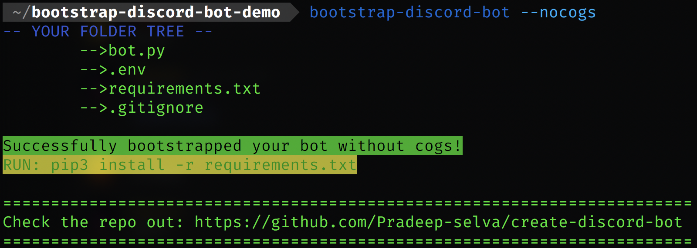

<h1 align="center">Bootstrap Discord Bot</h1>

<div align="center">
  <strong>An opinionated cli-tool to bootstrap your discord bot code!</strong>
  <p>Forget about boilerplate while making a discord bot. Just use a simple command</p>
</div>

## Demo

<div align="center">
    
</div>
<br/>

[](https://pepy.tech/project/bootstrap-discord-bot)
[](https://pepy.tech/project/bootstrap-discord-bot)
[](https://pepy.tech/project/bootstrap-discord-bot)

<br/>
<br/>

## Features

- Support for code with/without cogs.
- .env file support for keys and .gitignore to hide it.
- Bot code pre-built with a utility ping function to get you started!

## Usage

- Install using

```
pip install bootstrap-discord-bot
```

- cd into your bot directory

- Run `bootstrap-discord-bot -h` to get help

<div align="center">
    
</div>
<br/>
<br/>
<br/>

- Run `bootstrap-discord-bot --cogs` to initialise a discord bot with cogs.

<div align="center">
    
</div>
<br/>
<br/>
<br/>

- Run `boostrap-discord-bot --nocogs` to initialise a discord bot without cogs.

<div align="center">
    
</div>

## Built using

- Python
- Discord.py
- argparse
- setuptools
